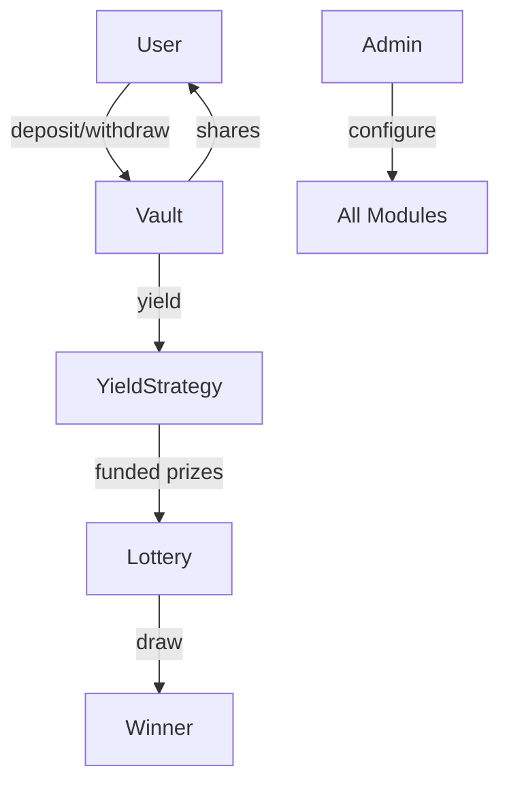

# Protocol Overview

MovePool is built with four core Move modules working together.

## Architecture



## Modules

### 🏦 Vault (`vault.move`)

The vault holds all user deposits and manages shares.

**Key Functions:**

- `deposit(amount)` — Deposit MOVE, receive shares
- `withdraw(shares)` — Burn shares, receive MOVE
- `get_user_shares(address)` — Query user's share balance
- `get_price_per_share()` — Current share price

**Share Math:**

```
shares = deposit_amount * PRECISION / price_per_share
```

### 🎲 Lottery (`lottery.move`)

Manages prize pools and draw execution.

**Pool Types:**
| Pool | ID | Interval | Yield Split |
|------|-----|----------|-------------|
| Quick Draw | 0 | 7 days | 70% |
| Jackpot | 1 | 30 days | 30% |

**Key Functions:**

- `enter_draw(pool_type, amount)` — Enter a draw with tickets
- `execute_draw(pool_type)` — Run the draw, pick winner
- `get_user_tickets(address, pool_type)` — Query ticket count

### 💰 Yield Strategy (`yield_strategy.move`)

Manages yield generation and prize funding.

**Key Concepts:**

- **Reserve**: Holds real tokens for prize payouts
- **Accrual**: Simulates yield based on APY
- Prizes are paid from reserve, not minted

**Key Functions:**

- `accrue_yield()` — Calculate and allocate yield
- `fund_reserve(amount)` — Top up prize reserve
- `get_reserve_balance()` — Check available funds

### ⚙️ Admin (`admin.move`)

Protocol governance and configuration.

**Configurable Parameters:**

- Draw intervals
- Yield split percentages
- APY rate
- Pause state

**Key Functions:**

- `update_quick_draw_interval(seconds)`
- `update_jackpot_interval(seconds)`
- `pause()` / `unpause()`

---

## Security Model

1. **Admin-only** functions require signer verification
2. **Pause** capability for emergency stops
3. **Reserve-backed** prizes—can't pay out more than funded
4. **No dilution**—PPS only increases or stays flat
