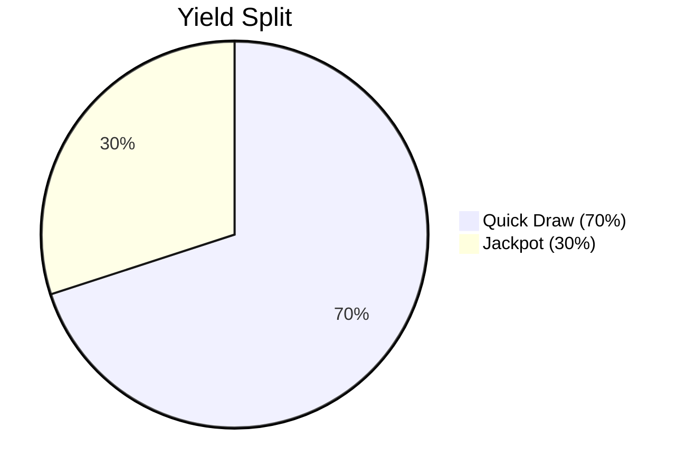

# Tokenomics

MovePool uses a **yield-funded prize model** with no protocol fees (during testnet).

## Token: MOVE

MovePool operates on Movement Testnet using the native **MOVE** token.

| Property | Value            |
| -------- | ---------------- |
| Symbol   | MOVE             |
| Decimals | 8                |
| Network  | Movement Testnet |

## Prize Distribution

Yield generated by the vault is split between two pools:

### Quick Draw Pool

- **Frequency**: Weekly
- **Share**: 70% of yield
- **Purpose**: Frequent wins keep users engaged

### Jackpot Pool

- **Frequency**: Monthly
- **Share**: 30% of yield
- **Purpose**: Large prizes attract attention

## APY and Yield

Current simulated APY: **12%**

This means a vault with 10,000 MOVE generates ~1,200 MOVE per year in prizes.


**Testnet Note**: Yield is simulated via `accrue_yield()` calls. On mainnet, this would connect to real yield sources.


## No Fees

During testnet, MovePool takes **0% protocol fees**. All yield goes to prizes.

## Referral Bonuses

| Action                | Reward                       |
| --------------------- | ---------------------------- |
| Referee's first entry | Referrer gets +5 tickets     |
| Link referrer         | On-chain relationship stored |

## Future Tokenomics (Mainnet)

Planned for mainnet launch:

- Protocol fee (e.g., 5% of yield)
- Governance token for voting
- Staking rewards for long-term depositors
